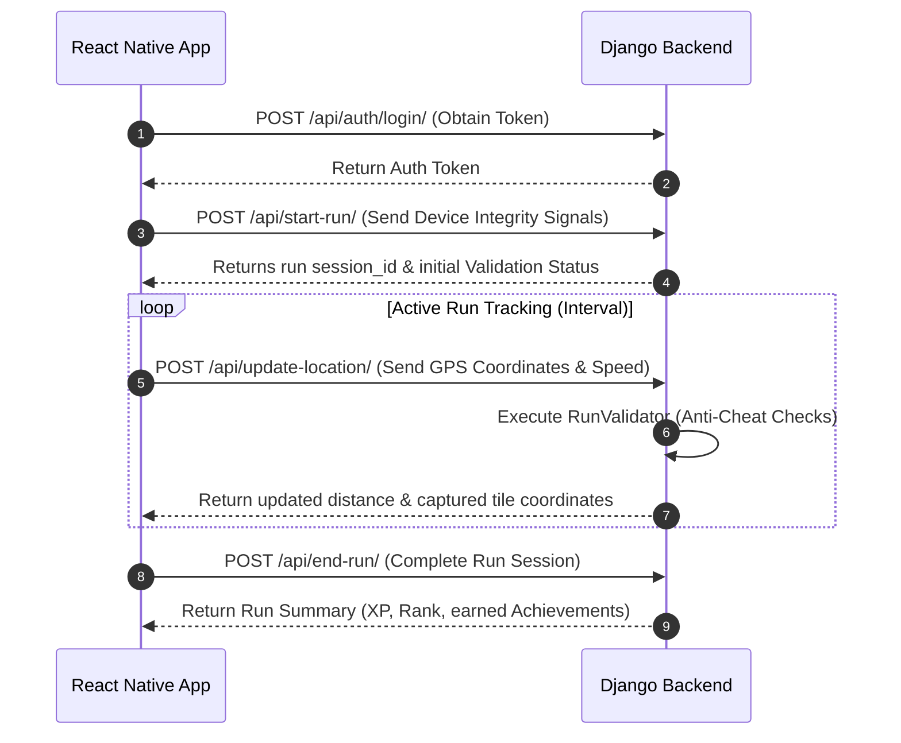

# 🏃‍♂️ KABZAA (কবজা) — Territory-Capture Running App

Welcome to **KABZAA**, a gamified, territory-capture fitness application. Players navigate the real world, record GPS-tracked runs, and conquer map grid tiles to claim territory. 

This repository houses a modular **Django REST API Backend** alongside **Expo React Native** mobile clients built for gameplay, animations, and social features.

---

## 🌟 Key Features & Gameplay Mechanics

*   📍 **Live Route Tracking**: Streams location data from the mobile device to render real-time GPS routes on a dark-themed gameplay map.
*   🟩 **Territory Capture Engine**: Converts latitude/longitude coordinates into localized grid indices, granting players tile ownership.
*   🏃‍♂️ **Animated Runner Avatar**: Features a custom-designed, glow-effect, humanoid avatar that dynamically strides, bobs, and rotates with the direction of travel.
*   🛡️ **Advanced Anti-Cheat System**: Server-side validation that inspects runs at three layers:
    *   **Device Checks**: Rejects starts from emulators or mock location providers.
    *   **GPS Speed Verification**: Filters out unrealistic speeds (warnings at $\ge$ 8.0 m/s; tile-capture blocks at $\ge$ 12.5 m/s).
    *   **Teleportation Blocker**: Detects jumps $\ge$ 250m at speeds $\ge$ 18 m/s.
    *   **User Trust Scoring**: Dynamically adjusts a player's trust profile (0–100) based on location reliability.
*   🏆 **Competitive Leaderboards**: Supports custom ranking filters (XP, total tiles, distance, weekly) alongside streak counters, challenges (e.g., weekly distance), achievements ("Heat Streak", "Long Signal"), and dynamically generated rival suggestions.

---

## 📂 Repository Layout

```yaml
├── backend/            # Django REST API, Token Auth, Run Sessions, & Anti-Cheat Engine
│   ├── api/            # App models (UserTrustProfile, RunSession, etc.), serializers, & views
│   └── backend/        # Security hardening settings, database configs, and custom CORS middleware
├── kabzaa-app/         # The complete product App workspace (Auth, Profile, Leaderboard, Territory)
└── frontend/          # High-fidelity prototype playground focused on Map rendering and Avatar UX
```

---

## 🛠️ Technical Stack

*   **Mobile Clients**: Expo SDK 54, React Native, React Navigation, React Native Maps
*   **Backend Services**: Python 3, Django, Django REST Framework (DRF), Token Authentication
*   **Location Services**: Expo Location API
*   **Database**: SQLite (configured for local development)

---

## 🚀 Getting Started

### 1. Run the Backend API
Navigate to the `backend/` directory, set up your environment, and spin up the server:
```bash
cd backend
pip install -r requirements.txt
python manage.py migrate
python manage.py runserver
```
The server will start at `http://127.0.0.1:8000`.

### 2. Run the Main App
Configure the client to point to your local or tunneled server IP in `kabzaa-app/app.json`. Then start the Expo packager:
```bash
cd kabzaa-app
npm install
npm start
```
Use **Expo Go** or an emulator (iOS/Android) to open and test the application.

---

## 📡 Core API Flow

A typical run tracking session moves through the following sequence:



---

## 📦 Building and Packaging (APK / iOS)

The application configurations are pre-defined in `eas.json` for building binaries:
*   **Android APK**: Generate an installable standalone package via EAS build:
    ```bash
    npx eas-cli build --platform android --profile preview
    ```
*   **iOS IPA**: Build using EAS (requires an Apple Developer Account):
    ```bash
    npx eas-cli build --platform ios
    ```

---

## 📈 Roadmap

1. [x] Server-side Anti-Cheat framework and models.
2. [x] Integrated Leaderboards and Streak challenges.
3. [ ] Mobile-client integration of `DeviceSignal` integrity checks at run start.
4. [ ] Production deployment setups (PostgreSQL database & Dockerizing).
5. [ ] Interactive maps with color-coded region boundaries based on captured tiles.
